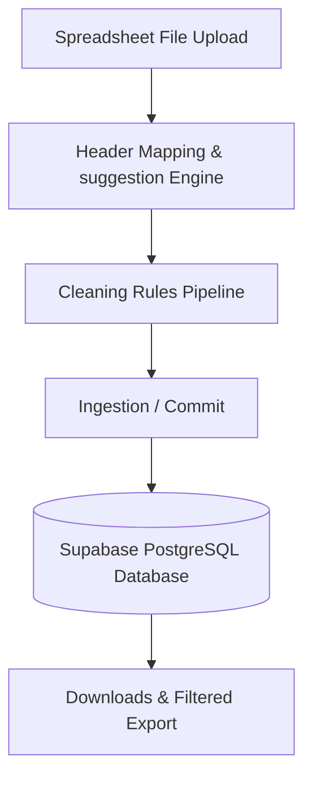
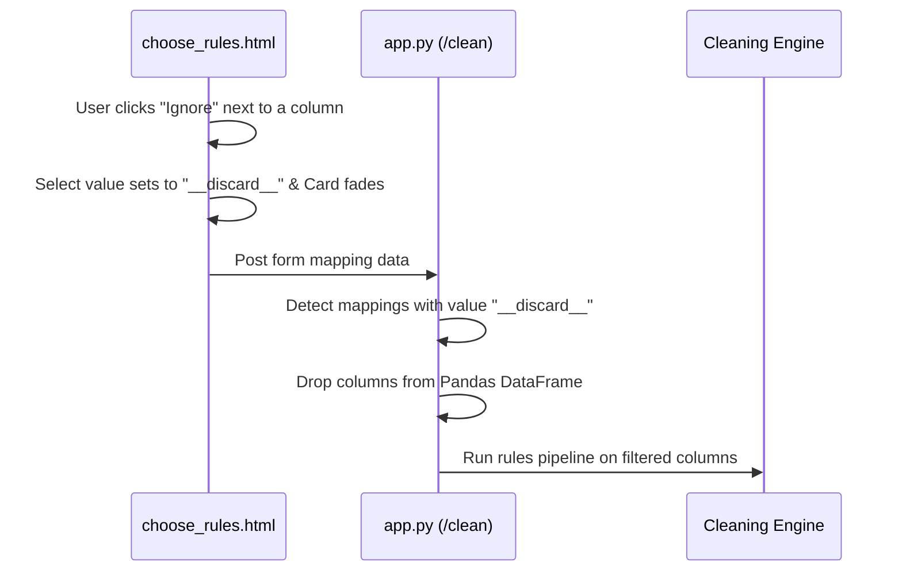

# Technical Documentation: Excel-Cleaner-2026 Core Architecture & Internals

This document provides a deep, technical breakdown of the architecture, database schema, and core features of the Excel-Cleaner-2026 application.

---

## 1. System Architecture Overview

The system is designed as a hybrid relational data validation and cleaning application. It allows dynamic mapping of user-provided spreadsheets to a semi-structured database schema.

### Technology Stack
* **Backend Framework**: Python (Flask)
* **Database Client**: `psycopg2` with custom MySQL-to-PostgreSQL wrapper classes (`PostgresConnectionWrapper`, `PostgresCursorWrapper`) supporting backward compatibility with `DESCRIBE` and backticks.
* **Data Processing**: `pandas`, `openpyxl`, `numpy`.
* **Frontend**: HTML5, Bootstrap 5, Vanilla CSS, Vanilla JavaScript.

---

## 2. Database Schema Design

The database schema is structured to accommodate user profiles, roles, and a dynamic hybrid schema for records.

### Core Tables
1. **`users`**: Contains credentials, deactivation status, and role info. Includes an `export_limit` column which overrides the default role limit.
2. **`role_export_limits`**: Maps role names (`admin`, `manager`, `team_lead`, `user`, `client`) to default daily export bounds (default `50,000` rows).
3. **`field_registry`**: Stores dynamic custom field configurations (display names, database keys, data types, searchable/active flags, and usage counts).
4. **`field_aliases`**: Translates user-uploaded spreadsheet headers to unified schema keys (either physical columns or custom field IDs).
5. **`master_records`**: The core storage table.
   - **Physical Columns**: Core fields (`first_name`, `last_name`, `imported_by`, etc.).
   - **JSONB Column (`custom_fields`)**: Stores all dynamic custom fields under their respective registry ID string keys (e.g., `{"3": "john.doe@email.com", "4": "9876543210"}`).
6. **`user_daily_exports`**: Tracks cumulative exports per user per day to enforce limits.

---

## 3. Core Feature Workings & Internals

### 3.1. Dynamic Ingestion & Hybrid Schema Mapping

When a user uploads a spreadsheet:
1. **Normalization**: The headers are normalized (converted to lowercase, special characters removed, and spaced joined by underscores).
2. **Alias Matching**:
   - The system queries `field_aliases` using the normalized header name.
   - If a match is found, the column maps to the mapped target.
   - If no match is found, a new custom field is created in `field_registry`, and a corresponding alias is automatically registered.
3. **Storage Routing**: During database commit, if the mapping target type is `master`, it is stored in the corresponding physical column. If it is `custom`, it is inserted into the `custom_fields` JSONB dictionary.

---

## 4. Dynamic Schema Conversion (Migrations)

The application supports bidirectional data migrations between Master columns (physical DB columns) and Custom fields (JSONB storage) on-the-fly:

### Convert Custom Field to Master Column
1. Adds a physical column to `master_records` via:
   `ALTER TABLE master_records ADD COLUMN "field_name" data_type`
2. Loops through all records containing the custom field ID key inside `custom_fields` JSONB.
3. Extracts the value, writes it into the new physical column, deletes the key from the JSONB dictionary, and commits.
4. Updates aliases targets to `master` and removes the old custom registry row.

### Convert Master Column to Custom Field
1. Registers a new custom field in `field_registry` and retrieves its ID.
2. Queries all rows where the physical column is not null or empty.
3. Inserts the column value into the `custom_fields` JSONB dictionary under the new field ID key, and updates the row.
4. Updates aliases targets to `custom` and drops the physical column via:
   `ALTER TABLE master_records DROP COLUMN "column_name"`

---

## 5. Column Ignoring / Exclusion Mechanism

* **Frontend**: Toggling "Ignore" sets the column mapping select to `__discard__` and changes opacity to `0.4`.
* **Backend**: In the `/clean` controller, before running rules, the system inspects mapping keys. Any column mapped to `__discard__` is dropped from the active sheet DataFrame using `df.drop(columns=[col])`.
* **Result**: The column is excluded from the preview, the generated Excel outputs, and database storage.

---

## 6. Export Controls & Daily Limits

1. **Daily Limit Enforcer**:
   - Before executing an export, the backend queries `user_daily_exports` for the user's today usage.
   - Counts matching rows for the filter query.
   - If `current_usage + request_rows > user_limit`, it returns a `400` status with a descriptive limit warning.
2. **Column Selection & Order**:
   - The user selects and drags columns in the download modal. The IDs are passed to `/api/records/export` as a comma-separated query parameter `export_cols`.
   - The backend maps display labels, filters only selected columns in the user-defined sequence, writes them to `openpyxl`, and streams the attachment.
